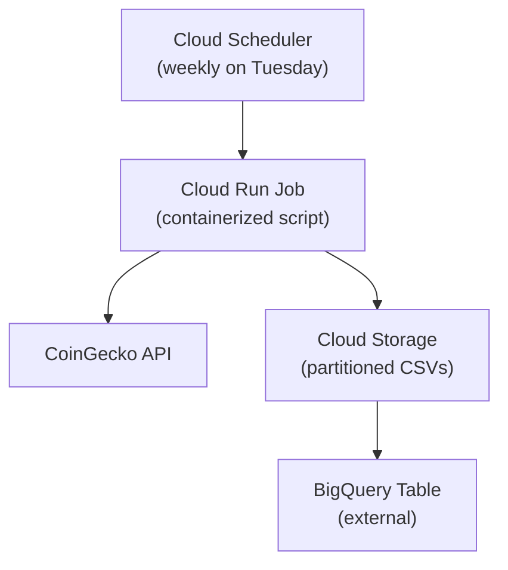

# Crypto Data Pipeline | Crypto Coin Tracker

A lightweight and containerized pipeline for collecting historical cryptocurrency data and uploading it to Google BigQuery.

This project is an adaptation of a real life solution presented to a client who needed to track his crypto portfolio and was built using **Google Cloud Platform** tools such as:

- **Google BigQuery** for scalable data storage and analytics
- **Cloud Storage** to stage partitioned CSVs
- **Cloud Run Jobs** to run the pipeline in a serverless container
- **Artifact Registry** to host the container image
- **Cloud Scheduler** to trigger the job weekly
---

## Project Structure

```
crypto_data_pipeline/
├── scripts/                 # Python modules
│   ├── __init__.py
│   ├── extract.py           # CoinGecko API logic
│   ├── transform.py         # Partitioning and formatting
│   ├── upload_to_gcs.py     # Uploads files to Cloud Storage
├── secrets/                 # GCP credentials (excluded from version control)
│   └── project-credentials.json
├── .gitignore
├── main.py                  # Pipeline entrypoint
├── requirements.txt
├── README.md                # Documentation
├── Dockerfile               # Docker setup
└── docker-compose.yml       # Local orchestration
```

---

## Data Flow Architecture



---

## What the pipeline does

1. Extracts historical price data from CoinGecko for predefined coins
2. Saves partitioned `.csv` files locally by year/month
3. Uploads the partitioned files to a GCS bucket
4. A BigQuery external table reads all CSVs from the bucket


---

## How to Run Locally

### Requirements:
- Python 3.12+
- Google Cloud credentials in JSON format
- CoinGecko API Key
- BigQuery dataset already created

### Environment Variables:
Create a `.env` file with:
```
GOOGLE_APPLICATION_CREDENTIALS=secrets/project-credentials.json
COINGECKO_API_KEY=insertyourapikeyhere
```

### Run with Docker

```bash
docker compose up --build
```

> Make sure the credentials file exists in `secrets/` and is mapped inside the container.

---

## GCP Costs (approximate)
- **BigQuery storage**: First 10 GB free, then $0.02/GB/month
- **BigQuery queries**: 1 TB free/month, then $5/TB
- **Cloud Run job**: Charged only while running (first 2 million requests free/month)
- **Cloud Scheduler**: Free up to 3 jobs/month
- **Cloud Storage**: First 5 GB free, then ~$0.026/GB/month
- **Artifact Registry**: Small cost based on usage, free tier available

---

## Future Improvements
- Validate schema before upload
- Parametrize coin list for optimization
- Add CLI options
